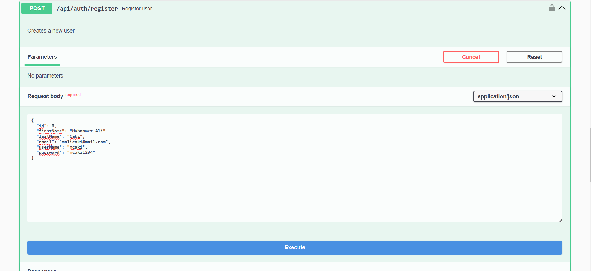
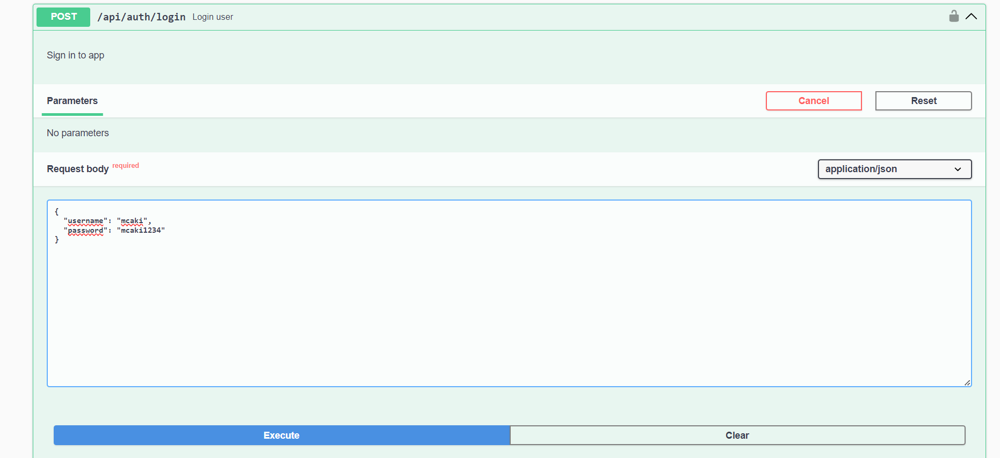
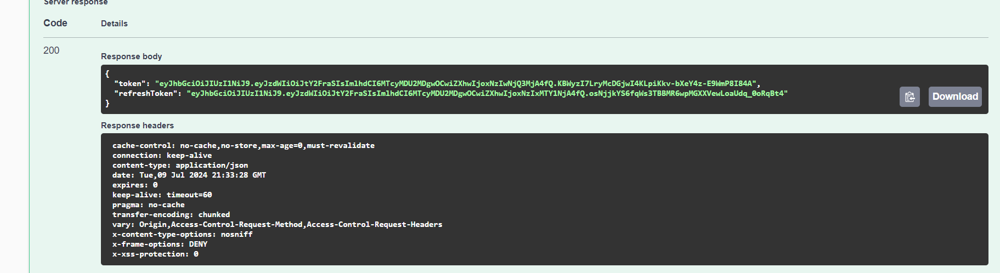
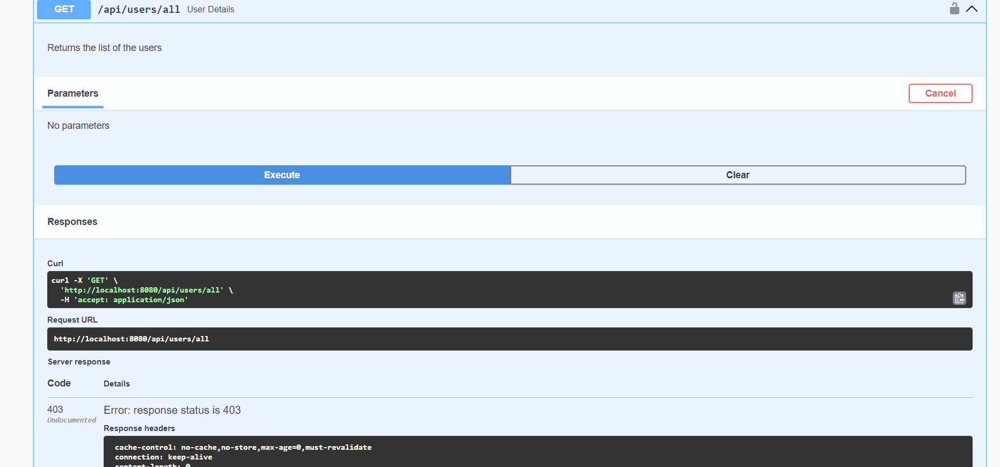
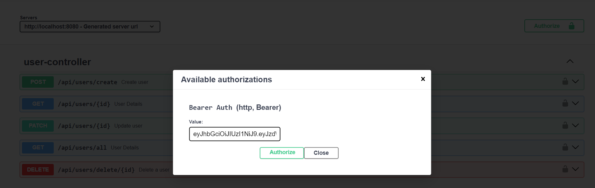
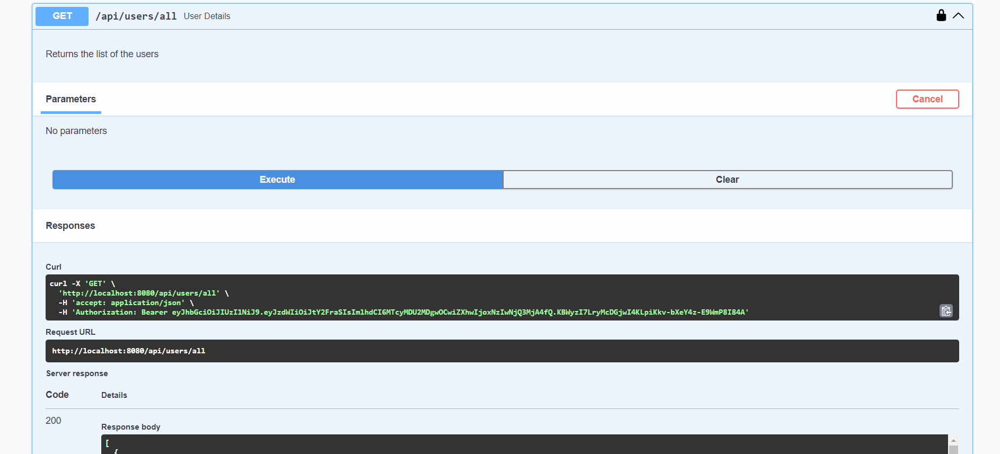

# Todo Application

This is a simple Todo application built with Spring Boot and Couchbase. The application allows users to register, create, update, and delete todo items and categories.

## Prerequisites

- Java 17
- Maven
- Couchbase
- Docker
- Spring Boot
- Spring Data Couchbase
- Swagger
- JUnit and Mockito

## Installation

1. **Clone the repository:**

```bash
git clone https://github.com/your-repo/todo-app.git
cd todo-app
```

2. **Install dependencies:**

```bash
mvn clean install
```

3. **Set up Couchbase:**

- Create a bucket named `todo-app`.
- Update the Couchbase connection details in `src/main/resources/application.properties`.

## Usage

1. **Build the application:**

```bash
mvn clean package
```

2. **Run the application:**

```bash
java -jar target/todo-app-0.0.1-SNAPSHOT.jar
```

3. **Access the application:**

Open your browser and navigate to `http://localhost:8080/swagger-ui.html`.

4. **Register and Login**

- First, you need register with /register url.

- Then login with /login url that user. (Passwords are stored in encrypted form)

- And get access token of the user.
- 
- Authorize swagger with access token



- Authentication completed. You can send other requests of the app
  
- You may use Refresh Token if you needed.

## Testing

To run the unit tests, use the following command:

```bash
mvn test
```

## Installation via Docker

1. **Build the Docker image:**

```bash
docker build -t todo-app .
```

2. **Run the Docker container:**

```bash
docker run -p 8080:8080 todo-app
```

***PS: Run with Docker has some problems with Couchbase connection. And some extra features like 'Lists of all categories and ToDos for Today' has some bugs. It will be fixed soon via update***

## License

This project is licensed under the MIT License - see the [LICENSE](LICENSE) file for details.
